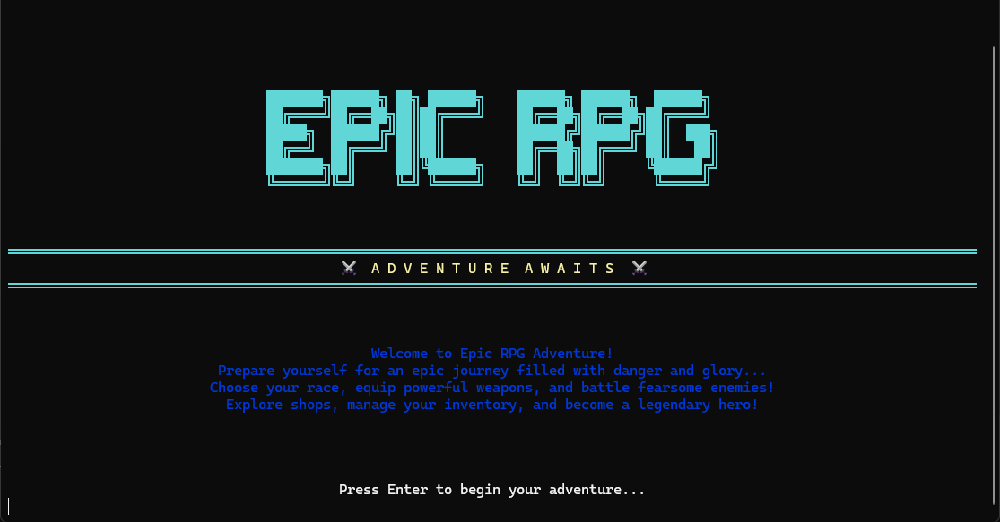

  

## 🎮 Overview

An immersive completely terminal based RPG game featuring classic turn-based combat, character progression, with weapons/spells and bosses. Built entirely with Python.

## ⚔️ Game Features

- **Character Races** - Choose from races including: Human, Orc, Elf... etc.
- **Turn-based Combat** - Strategic battle system with special abilities
- **Inventory System** - Collect weapons, armor, and consumables
- **Shop** - Unlock new abilities and weapons through the shop with the gold gained
- **Durability System** - Weapon and armor durability 

## 🛠️ Technical Implementation

 

## 🏆 Achievements

- **0 Dependencies** - Built entirely with Python
- **Rich** - Intuitive terminal design
- **Batch** - Launchable through a batch file for easy of play
---

*A passion project showing my love of LOTR* 