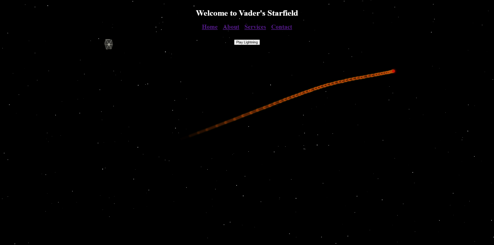

  

## 🌌 Overview

An immersive Star Wars themed interactive experience that brings the dark side to life through cutting-edge web technologies. Featuring stunning 2D canvas animations, atmospheric sound design, and engaging user interactions that transport visitors to a galaxy far, far away.

## ⚡ Features

- **2D Lightsaber Animation** - Interactive lightsaber with realistic canvas designs
- **Immersive Sound Design** - Authentic Star Wars audio effects
- **Dark Side Theming** - Atmospheric UI with Imperial aesthetics
- **Responsive Experience** - Optimized across all devices

## 🛠️ Technical Stack

## 🎵 Audio Experience

- **Imperial March** - Dynamic orchestral soundtrack
- **Lightsaber Sounds** - Authentic hum, clash, and ignition effects
- **Force Powers** - Spatial audio for telekinetic demonstrations

---

*"The Force is strong with this one" - Optimized for the modern web* 